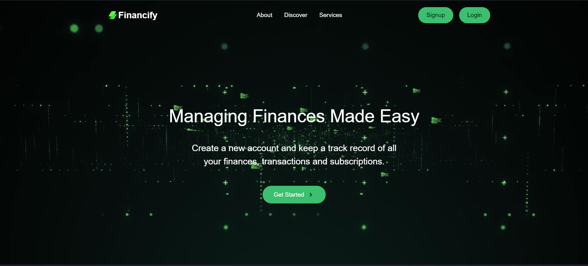
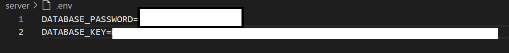

<!-- PROJECT LOGO  -->
<br />
<p align="center">
  <a href=https://github.com/Berlingithub/Financify.git>
    
  </a>

  <h3 align="center">FINANCIFY</h3>
  
  <p align="center">
  <a align="center" href="https://financify-zeta.netlify.app/">https://financify-zeta.netlify.app/</a><br />
  (Best experienced on Firefox Browser)
  <br />
    A web-app made using MERN stack which acts as a hub for all the transactions, subscriptions and goals one wants to keep a track of.
    Record your transactions by just clicking a photo of the bill/receipt.
    <br />
  </p>
</p>

<!-- ABOUT THE PROJECT -->
## About The Project
<p>
    The idea is to help people view and study their overall spend analysis by developing a web app to analyze all the purchases. It is often noticed that we spend more than we     earn which is wrong. To address it and keep a record of all the spending and earnings, we have created Financify wherein users can keep a log of their finances and manage them wisely. 
</p>

<!-- [![Product Name Screen Shot][product-screenshot]](https://example.com) -->

<!-- Problem Statement -->
## Problem Statement
<p>
  We make transactions every day, and we are never consistent. We use cash, card, or digital wallets and it gets very difficult to actually track where our money goes by the end of the month. We need one single platform for us to track our transactions and help analyze how we can be smart consumers to save as much as possible by spending as little as possible. Rather than going through all the bills at the end of the month, what if we could just click a photo and everything else happens automatically?  
</p>


### Built With

* [React.js](https://reactjs.org/)
* [Node.js](https://nodejs.org/en/)
* [Mongo DB](https://www.mongodb.com/)
* [Bootstrap](https://getbootstrap.com)
* [React Bootstrap](https://react-bootstrap.github.io/)


<!-- GETTING STARTED -->
## Getting Started

This is how you can access this project locally.To get a local copy up and running follow these simple example steps.

### Prerequisites


* latest version of Node.js and NPM installed on your system
* A .env file with environment variables

### Installation

1. Clone the repo
   ```sh
   git clone https://github.com/Berlingithub/Financify.git
   ```
2. Install NPM packages in client and server respectively
   ```sh
   cd client
   npm install
   ```
    ```sh
   cd server
   npm install
   ```
3. Create your env file in server directory. Add the below mentioned fields and your respective keys:
    ```
    DATABASE_PASSWORD
    DATABASE_KEY
    ```
    
5. Start the server and react-script
   ```JS
   cd server
   node index.js
   ```
   ```JS
   cd client
   npm start
   ```
6. Head over to http://localhost:3000/ on your system and you are good to go.


### Project Structure ###

Financify/
└── Financify-main/
    ├── client/                # React frontend
    │   ├── public/
    │   ├── src/
    │   │   ├── ...
    │   │   └── index.js
    ├── Server/                # Express backend
    │   ├── Models/
    │   ├── Routes/
    │   ├── index.js           # Main Express file
    │   ├── .env               # Backend env file
    ├── package.json           # Combined package.json or backend’s
    ├── README.md

